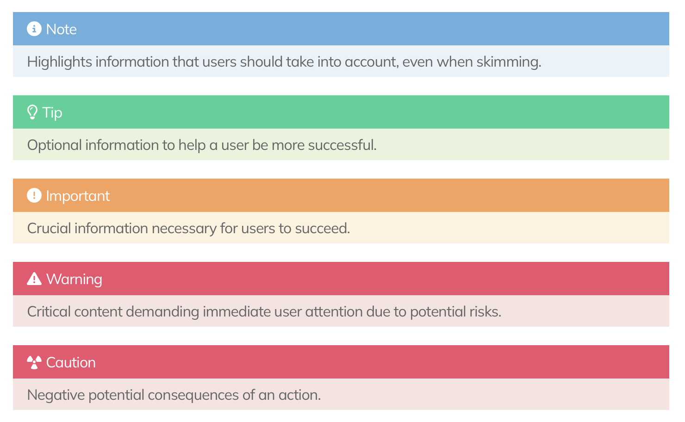

# UserFrosting Learn Documentation

TODO

## Markdown Syntax

### Alert Syntax

```
> [!NOTE]  
> Highlights information that users should take into account, even when skimming.

> [!TIP]
> Optional information to help a user be more successful.

> [!IMPORTANT]  
> Crucial information necessary for users to succeed.

> [!WARNING]  
> Critical content demanding immediate user attention due to potential risks.

> [!CAUTION]
> Negative potential consequences of an action.
```

Result : 


### Footnote Syntax

Sample Markdown input:

```Duis mollis, est non commodo luctus, nisi erat porttitor ligula, eget lacinia odio sem nec elit.
Lorem ipsum dolor sit amet, consectetur adipiscing elit. Morbi[^note1] leo risus, porta ac consectetur ac.

[^note1]: Elit Malesuada Ridiculus```


