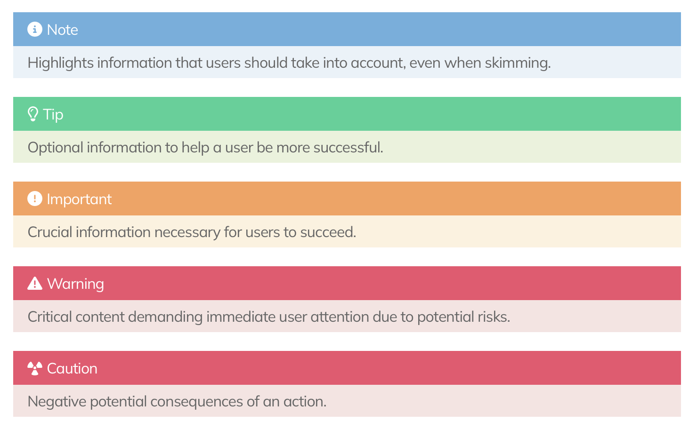

# UserFrosting Learn Documentation
[](https://github.com/userfrosting/sprinkle-core/actions)
[](https://app.codecov.io/gh/userfrosting/sprinkle-core/branch/5.2)
[](https://chat.userfrosting.com)
[](https://ko-fi.com/lcharette)

This repository contains the source for the [UserFrosting Learn](https://learn6.userfrosting.com) documentation website — the official documentation hub for [UserFrosting](https://github.com/userfrosting/UserFrosting).

The site is built on **UserFrosting 6** and serves versioned Markdown documentation pages from `app/pages/{version}/`. The frontend uses **Vite** and **Vue 3** with the Pink Cupcake theme.

## Running Locally

**Without Docker:**
```bash
# Terminal 1 – PHP backend
php bakery serve

# Terminal 2 – Vite dev server
npm run vite:dev
```

**With Docker:**
```bash
docker compose up -d
```

The app is available at `http://localhost:8080`.

## Building & Testing

```bash
# Frontend
npm run vite:build   # Production build
npm run typecheck    # TypeScript type checking
npm run lint         # ESLint (auto-fix)
npm run test         # Vitest unit tests
npm run coverage     # Coverage report

# Backend
vendor/bin/phpunit   # PHPUnit tests
vendor/bin/phpstan   # Static analysis
```

## Contributing Documentation

Documentation pages live in `app/pages/{version}/` as Markdown files (e.g. `app/pages/6.0/01.quick-start/docs.md`). Folder numeric prefixes control sidebar ordering.

- Standalone pages use `docs.md`; chapter landing pages use `chapter.md`
- Images must be stored alongside pages and referenced with an absolute path starting with `/` (e.g. `/images/screenshot.png`)
- Internal links use absolute paths without version numbers (e.g. `/installation/requirements`)

## Markdown Syntax

### Alert Syntax

```
> [!NOTE]  
> Highlights information that users should take into account, even when skimming.

> [!TIP]
> Optional information to help a user be more successful.

> [!IMPORTANT]  
> Crucial information necessary for users to succeed.

> [!WARNING]  
> Critical content demanding immediate user attention due to potential risks.

> [!CAUTION]
> Negative potential consequences of an action.
```

Result : 


### Footnote Syntax

Sample Markdown input:

```Duis mollis, est non commodo luctus, nisi erat porttitor ligula, eget lacinia odio sem nec elit.
Lorem ipsum dolor sit amet, consectetur adipiscing elit. Morbi[^note1] leo risus, porta ac consectetur ac.

[^note1]: Elit Malesuada Ridiculus```


